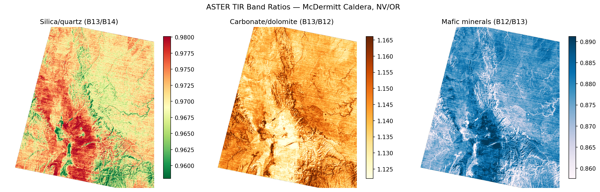
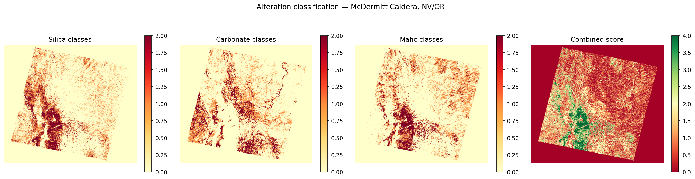
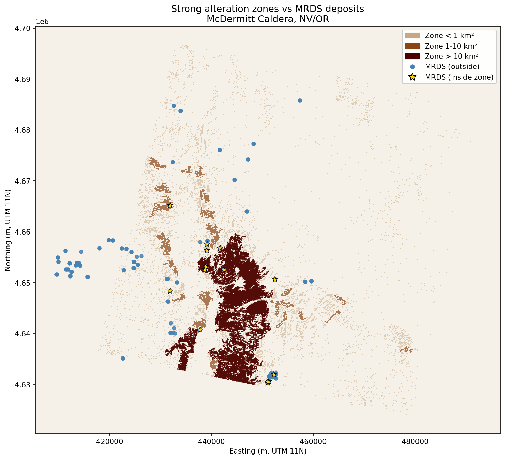
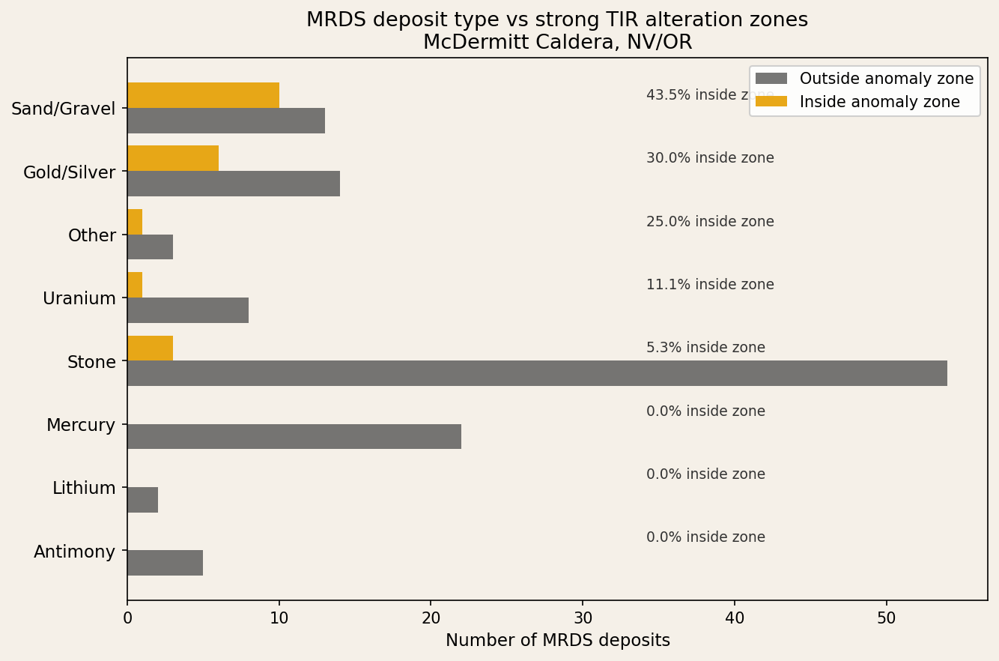

# critical-minerals-aster

Spectral alteration mapping of the McDermitt Caldera (NV/OR) using ASTER thermal infrared data and band ratio analysis. This project demonstrates a reproducible remote sensing pipeline for critical mineral exploration targeting.

---

## Scientific questions

1. Do ASTER-derived TIR alteration zones spatially correlate with known mineral occurrences in the USGS MRDS database?
2. Which TIR band ratio combinations best distinguish silica, carbonate, and mafic alteration in an arid caldera setting?
3. Does the correlation between alteration zones and MRDS deposits vary by commodity type — and does that pattern make geological sense?

---

## Study area

The **McDermitt Caldera** straddles the Nevada/Oregon border and hosts one of the largest known lithium claystone deposits in North America (Lithium Americas, Jindalee Resources). The caldera is also historically significant for mercury, uranium, and gold mineralization — making it an ideal test case for multi-commodity exploration targeting.

---

## Data sources

| Dataset | Source | Notes |
|---|---|---|
| ASTER L1T (v004) | NASA EarthData / LP DAAC | July 23, 2010 granule, UTM Zone 11N |
| MRDS national deposit database | USGS mrdata.usgs.gov | Filtered to McDermitt bbox |

**Note on SWIR availability:** ASTER SWIR bands (B04–B09), which are standard for clay/argillic alteration mapping, are not yet available in the LP DAAC v004 cloud archive for this area. This project uses TIR bands (B10–B14, 8–12 µm) instead, which are well-suited for silica, carbonate, and mafic mineral mapping in arid volcanic terranes.

---

## Methods

### Band ratios

| Ratio | Formula | Target mineral |
|---|---|---|
| Silica/quartz | B13/B14 | Silicic alteration, rhyolite |
| Carbonate/dolomite | B13/B12 | Hydrothermal carbonate |
| Mafic | B12/B13 | Mafic volcanic rocks |

### Classification

Percentile-based thresholds (70th and 90th) applied to each ratio band produce a 3-class anomaly map (background / moderate / strong). An additive combined score (0–6) identifies pixels anomalous across multiple indicators.

Strong anomaly zones (combined score ≥ 3) are vectorized to polygons using `rasterio.features.shapes`.

### Deposit overlay

MRDS deposits within the scene bounding box are spatially joined to strong anomaly zones. Hit rate and commodity breakdown are used to evaluate whether the alteration signature correlates with known mineralization.

---

## Key results

- **8,587 strong anomaly zones** identified, totaling **441 km²**
- Largest single zone: **185.9 km²** centered on the caldera floor
- **21 of 142 MRDS deposits (15%)** fall within strong anomaly zones

### Commodity correlation

| Commodity | % inside anomaly zone | Interpretation |
|---|---|---|
| Mercury | 0% | Fault-hosted, structurally controlled — not alteration-zone associated |
| Lithium | 0% | Lake sediment-hosted claystone — different TIR signature than volcanic alteration |
| Antimony | 0% | Structurally controlled |
| Uranium | 11% | Weak association |
| Gold/Silver | 30% | Moderate association with silicic/epithermal alteration |
| Sand/Gravel | 44% | Spatial overlap with caldera floor, not geologically meaningful |

The 0% hit rate for mercury is geologically coherent: McDermitt Hg deposits are structurally controlled along caldera-margin faults, outside the broad hydrothermal alteration footprint mapped here. Similarly, Li claystone deposits are hosted in lacustrine sediments with a distinct spectral character not captured by TIR ratios alone.

---

## Figures

**TIR band ratio maps**


**Alteration classification and combined score**


**Deposit overlay map**


**Commodity correlation with anomaly zones**


---

## Repo structure

```
critical-minerals-aster/
├── sites/
│   └── mcdermitt.yaml              # per-site bbox, granule, classification params
├── src/
│   └── critical_minerals_aster/    # shared library (paths, spectral, classification, MRDS helpers)
├── docs/
│   └── implementation-phases.md     # piecewise rollout plan (Phases A–F)
├── notebooks/
│   ├── 00_verify_setup.ipynb       # environment verification
│   ├── 01_data_download.ipynb      # EarthData auth, ASTER download
│   ├── 02_band_ratios.ipynb        # TIR band ratios, false-color composite
│   ├── 03_classification.ipynb     # anomaly classification, vectorization
│   └── 04_deposit_overlay.ipynb   # MRDS spatial join, commodity analysis
├── tests/                          # lightweight unit tests
├── data/                           # not committed (downloaded by notebooks)
├── figures/                        # output maps
├── environment.yml
├── pyproject.toml
└── README.md
```

---

## Reproducing this analysis

### 1. Clone the repo

```bash
git clone git@github.com:nicole-m-aikin/critical-minerals-aster.git
cd critical-minerals-aster
```

### 2. Create the environment

```bash
conda env create -f environment.yml
conda activate aster-minerals
pip install -e .
```

Or follow the manual dependency list below, then from the repo root run `pip install -e .` so notebooks can import `critical_minerals_aster` (adds `src/` to the package path).

### 3. Set up EarthData credentials

Create a free account at [urs.earthdata.nasa.gov](https://urs.earthdata.nasa.gov). The notebooks use `earthaccess.login(strategy="interactive")` to authenticate on first run.

### 4. Run notebooks in order

Run `00` through `04` in sequence. Notebook `01` downloads ~200MB of ASTER data to `data/aster/`.

---

## Dependencies

- `rasterio` — raster I/O and feature extraction
- `geopandas` / `shapely` — vector operations and spatial joins
- `earthaccess` — NASA EarthData authentication and download
- `numpy` / `scipy` — array operations
- `matplotlib` — visualization
- `scikit-learn` — available for classification extension (notebook 03)
- `spectral` — available for SAM extension

---

## Author

**Nicole Aikin** — MS Earth & Space Sciences, University of Washington (2025)
Metamorphic petrology · geochronology · ML pipelines for geoscience
[github.com/nicole-m-aikin](https://github.com/nicole-m-aikin)