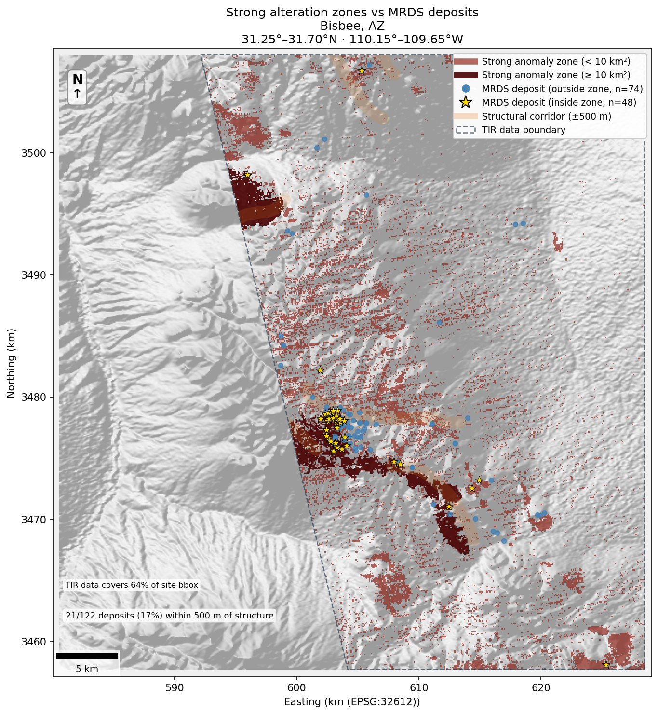
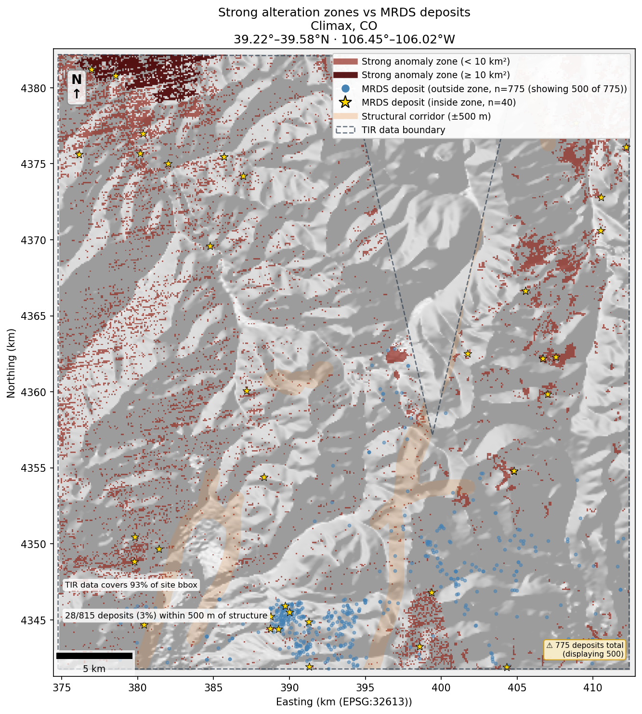

# Results

ASTER TIR alteration mapping across 37 US critical mineral sites. Full figures: [`figures/index.html`](../figures/index.html).

---

## Site-level hit rates

**15 of 37 sites** show hit rates significantly above chance on the all-deposit binomial test (null = 8.2% pooled). **12 of 37** remain significant when restricted to critical-mineral deposits only (figure 06; null = 9.7% critical-only pooled). The three sites that drop under the critical-only test — Iron Springs (Fe skarn; iron is non-critical), Darwin (Pb-Zn skarn), and Green River (aggregate-driven; 0 critical hits) — are discussed in [Non-critical inflation](#non-critical-inflation).

| Site | Hit rate (all deposits) | Binomial p | Deposit type |
|---|---|---|---|
| Bisbee, AZ | 39.3% (48/122) | < 0.001 | Skarn / VMS Cu-Zn |
| Thacker Pass, NV | 34.4% (11/32) | < 0.001 | Lithium brine / sediment |
| Magnet Cove, AR | 22.1% (17/77) | < 0.001 | Carbonatite REE |
| McDermitt Caldera, NV/OR | 19.0% (20/105) | < 0.001 | Li-Cs-REE caldera |
| Yerington, NV | 15.9% (25/157) | 0.001 | Porphyry Cu / epithermal |
| Steamboat Springs, NV | 13.8% (30/217) | 0.004 | Epithermal Au-Ag / geothermal |
| Darwin, CA | 13.5% (31/229) | 0.005 | Skarn Pb-Zn-Ag |
| Iron Springs, UT | 13.8% (22/159) | 0.012 | Fe skarn |
| Hanover-Fierro, NM | 23.1% (6/26) | 0.017 | Skarn Cu-Pb-Zn |
| Mountain Pass, CA | 11.6% (40/345) | 0.019 | Carbonatite REE |
| Ely (Robinson), NV | 21.4% (6/28) | 0.024 | Porphyry Cu-Au |
| Silver Peak, NV | 12.8% (22/172) | 0.027 | Li brine / epithermal |
| Lemhi Pass, ID/MT | 15.7% (11/70) | 0.028 | Vein-hosted Th/REE |
| Green River Basin, WY | 16.7% (8/48) | 0.041 | Sediment-hosted (aggregate-driven)¹ |
| Globe-Miami, AZ | 12.0% (24/200) | 0.041 | Porphyry Cu / skarn |

¹ Green River significance driven by non-critical (aggregate/industrial) deposits; 0 critical-mineral hits.

*Figure 05 — Critical-mineral hit rate by site (non-critical excluded). Bar colour = Earth MRI category of in-zone critical deposits. Sites above the dashed reference line (8.2%) have more hits than the pooled null rate.*

**Near-significant** (0.05 ≤ p < 0.15): Viburnum Trend, MO (11.4%, p = 0.085); Battle Mountain, NV (12.2%, p = 0.122).

**Anti-correlated** (p > 0.95 — deposits actively avoid anomaly zones): Goldfield-Cuprite NV, Ducktown TN, Oatman AZ, Stillwater Complex MT, Bingham Canyon UT, Mineral Park AZ, Climax CO, Jerritt Canyon NV, Elk Creek NE.

Anti-correlations are geologically coherent: Climax is a deep porphyry Mo with no surface alteration expression; Ducktown is a VMS deposit buried under dense Tennessee forest (see figure below); Oatman and Goldfield are epithermal Au systems where the alteration cap is eroded or buried; Stillwater is a layered mafic intrusion where PGM mineralization has no alteration expression at the surface; Bingham Canyon's strongest anomaly zones correspond to Wasatch Front carbonates east of the Oquirrh Mountains, not the mine itself.

**Bisbee — strongest positive (39.3%):**

*Figure — Bisbee, AZ. Red zones = strong TIR alteration; yellow stars = MRDS deposits inside zones (n=48); blue circles = deposits outside zones (n=74). The anomaly cluster corresponds spatially to the Warren Mining District skarn and VMS bodies.*

**Climax — anti-correlation example (0.2%, 1/472):**

*Figure — Climax, CO. The porphyry Mo system produces almost no surface TIR alteration; 471 of 472 deposits fall outside anomaly zones. The zones reflect carbonate-bearing country rock in the surrounding Sawatch Range, not mineralization.*

---

## Methodology note: per-granule classification

Results use **per-granule percentile classification** before mosaicking. Percentile thresholds (70th/90th) are applied within each granule's scene extent independently, then classified maps are max-merged across granules. This preserves local contrast — a deposit that ranks in the top 10% within its granule retains that signal in the merged map. Earlier runs using pooled percentiles across the full mosaic extent diluted local anomalies, producing only 3 significant sites. The per-granule approach recovered 15 (all-deposit test) / 12 (critical-only test).

---

## Non-critical inflation

Non-critical deposits (stone, sand, gravel, aggregate) have a **higher** pooled hit rate (12.6%, 213/1,692) than critical minerals. ASTER TIR detects silica and carbonate enrichment — exactly the mineralogy that makes rock commercially useful as aggregate.

*Figure 07 — All-deposit vs critical-mineral hit rate per site. A long rightward grey tail indicates aggregate inflation. Green River, Silver Peak, and Darwin show the largest gaps. Steamboat Springs is one of the few sites where all-deposit and critical-only rates are nearly equal.*

**Green River, WY** is the clearest example: nearly all MRDS records in the footprint are non-critical (aggregate, trona, oil shale). The site is binomially significant on all-deposit counts (p = 0.041) but has zero critical-mineral hits.

**Iron Springs, UT** is significant on all-deposits (p = 0.012) but Fe skarn is classified non-critical, so it also drops from the critical-only list. The TIR signal is real — the Fe-bearing skarn rocks produce a strong anomaly — but iron does not qualify as a critical mineral.

**Aggregate quarry application:** The non-critical correlation is a real economic signal for aggregate quarry siting. The `earth_mri_category = 'Non-Critical'` rows in each site's CSV are the right lens for that use case.

---

## By Earth MRI category

| Category | Hit rate | n deposits | TIR-detectable? | Notes |
|---|---|---|---|---|
| Battery Metals – Li/Brine | 14.3% | 7 | Yes | Small n; Thacker Pass / McDermitt / Silver Peak drive this |
| Energy (uranium) | 8.9% | 676 | Partial | Roll-front U has no surface alteration; signal from associated skarn/breccia |
| Battery Metals – Co/Ni | 8.8% | 296 | Yes | Mafic/ultramafic host rock; mafic ratio picks up ultramafic country rock |
| Base Metals | 7.9% | 1837 | Yes | Porphyry/skarn/VMS alteration halos |
| Specialty/High-Tech | 6.4% | 171 | Partial | Depends on host rock type |
| PGM | 6.2% | 16 | No | Stillwater layered intrusion anti-correlated; small n |
| Gold/Silver | 5.8% | 2385 | Partial | Caldera/epithermal Au yes (Yerington, Ely); Carlin/placer no |
| Industrial | 5.7% | 371 | No | Structurally/sediment-hosted |
| REE | 0.0% | 29 | Indirect | See note below |
| Non-Critical (aggregate) | 12.6% | 1692 | Yes — different application | See above |

**REE category note:** Pooled REE-category hit rate is 0% (0/29), but two carbonatite REE sites are significant (Mountain Pass p = 0.019, Magnet Cove p < 0.001). The contradiction arises because MRDS deposits at these sites are classified primarily as Base Metals or Gold/Silver (associated skarns and veins) rather than REE under the Earth MRI reclassifier. The TIR signal co-locates with mineralized ground, but the hits land on skarn/vein MRDS records, not the REE-coded ones. Lemhi Pass (vein-hosted Th/REE, p = 0.028) adds a third REE-district positive.

No category reaches national significance individually; signal is site-specific rather than category-wide. Mineral system standouts: carbonatite, porphyry Cu-Au, and skarn systems have the highest pooled hit rates. Sediment-hosted (Carlin, MVT, roll-front) and placer systems score at or below chance.

---

## Structure proximity

Structural proximity alone does not predict TIR detectability. Significant sites span the full range of mean deposit–fault distances on the log scale.

*Figure 06 — Structural proximity vs spectral detectability. Point size = number of MRDS deposits in bbox. Red = significant on critical-only binomial test (p < 0.05, n=12). Orange = significant on all-deposit test only, significance driven by non-critical (aggregate/Fe) deposits (n=6: Iron Springs, Darwin, Globe-Miami, Silver Peak, Lemhi Pass, Green River). No correlation between fault proximity and hit rate; deposit type and surface alteration exposure are the dominant predictors.*

**Ozark site caveat:** Pea Ridge and Viburnum Trend have structural corridor buffers covering 40–50% of map area, reflecting the density of mapped Missouri Ozark faults rather than real structural control on mineralization. The "% of deposits within 500 m of structure" metric is inflated at these sites.

---

## Spatial coverage notes

ASTER TIR granules are ~60 × 60 km swaths at an oblique angle and do not always fill the full configured site bbox. MRDS deposits are clipped to the **valid-pixel footprint polygon** (the actual diagonal scene boundary) before counting. Zone coverage fraction uses footprint area, not bbox area. The TIR boundary is shown as a dashed polygon on each figure 03.

**33 of 37 sites use multi-granule mosaics.** Classification is applied per-granule (see methodology note above), then max-merged. Ratio mosaics (used for visualization figures only) use feathered blending with histogram normalization.

**Sites with partial TIR coverage:**

| Site | Notes |
|---|---|
| Green River, WY | ~50% of bbox covered; 0 critical hits |
| Bisbee, AZ | ~64% of bbox; parallelogram ASTER swath, NE corner absent |
| Yerington, NV | ~55% of bbox; diagonal upper-left cutoff |
| Gas Hills, WY | ~72% of bbox; diagonal lower-right corner clipped |
| Pea Ridge, MO | ~86% of bbox; main deposit cluster within covered area |

**Bingham Canyon spatial mismatch:** The dominant TIR anomaly at this site corresponds to Wasatch Front carbonate formations east of the Oquirrh Mountains, not the Bingham Canyon porphyry system. MRDS deposit points cluster in the center-left of the bbox (the mine area), which produces a weaker TIR signal.

**Ducktown — vegetation anti-correlation:**

*Figure — Ducktown, TN. Same VMS deposit type as Bisbee (significant, 39.3%), but in forested Tennessee. Vegetation cover suppresses the TIR alteration signal; p ≈ 1. This contrast directly demonstrates why the method is primarily applicable to arid/semi-arid terrain.*

---

## Interpretation limits

- **TIR-only:** SWIR clay/argillic mapping (B04–B09) is not available in LP DAAC v004 for these areas. The method maps silica, carbonate, and mafic mineralogy but misses argillic/phyllic alteration halos detectable with SWIR.
- **Scene-relative thresholds:** Percentile classification is per-granule; anomaly scores are not comparable across sites.
- **MRDS uncertainty:** Deposit locations are report-derived and may be offset from true outcrop or mineralized footprint.
- **Significance null model:** Binomial test assumes uniform deposit distribution within the footprint. Spatial clustering of real deposits makes p-values conservative — actual null distributions are not uniform.
- **Vegetation cover:** Forest cover suppresses TIR alteration signal. Ducktown (VMS, Tennessee) anti-correlates where Jerome and Bisbee (same deposit type, arid Arizona) are strong positives. The method is primarily applicable to arid/semi-arid terrain.
- **Anti-correlations are informative:** p ≈ 1 means the method is physically incapable of detecting the dominant deposit type at that site under current surface conditions, not that the zones are wrong.

---

## Figures

| Figure | Content |
|---|---|
| `figures/05_national_hit_rates.png` | Stacked bar by Earth MRI category, critical minerals only; sites sorted by hit rate |
| `figures/06_structure_hit_rate.png` | Log-scale scatter: mean fault distance vs critical-only hit rate; red = significant (n=12) |
| `figures/07_hitrate_comparison.png` | Paired dot plot: all-deposits vs critical-only hit rate per site; exposes aggregate inflation |
| `figures/sites/{id}/00_composite_rgb.png` | False-color TIR composite |
| `figures/sites/{id}/01_tir_band_ratios.png` | Three band ratio maps |
| `figures/sites/{id}/02_classification.png` | Per-ratio classification + combined score |
| `figures/sites/{id}/03_deposit_overlay.png` | Anomaly zones, MRDS deposits, fault corridors, scale bar |
| `figures/sites/{id}/05_structure_proximity.png` | Strip chart: deposit distance to nearest fault by commodity group |
