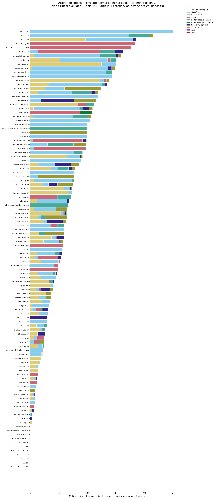
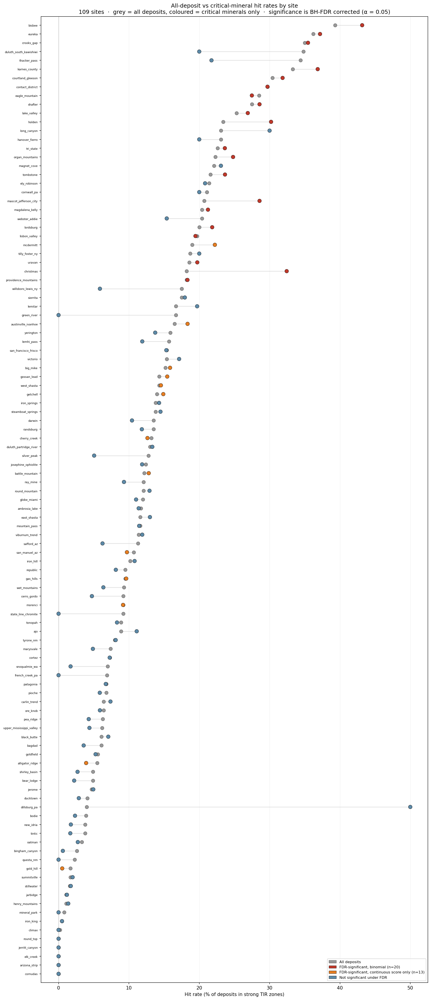
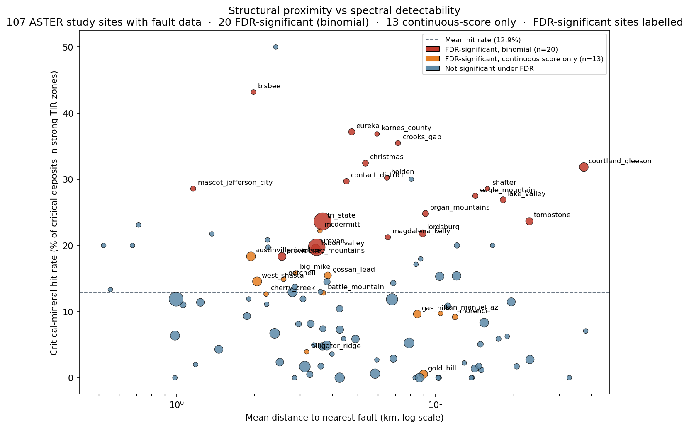

# Results

ASTER TIR alteration mapping across 45 US critical mineral sites. Full figures: [`figures/index.html`](../figures/index.html).

---

## Site-level hit rates

**15 of 45 sites** are significant on at least one binomial test. Two tests are reported: critical-mineral-only (null = 8.5% pooled across critical MRDS records) and all-deposit (null = 9.5% pooled across all MRDS records). **12 sites clear the critical-only threshold**. **3 additional sites** are significant only on the all-deposit test (non-critical or base-metals driven).

### Significant on critical-mineral test (12 sites)

Hit rates below are critical-mineral deposits only (non-critical excluded). Null = 8.5%.

| Site | Critical hit rate | p (critical) | Deposit type |
|---|---|---|---|
| Bisbee, AZ | 43.2% (41/95) | < 0.001 | Skarn / carbonate-hosted Cu-Ag |
| Eureka, NV | 37.2% (71/191) | < 0.001 | Pb-Zn-Au-Ag skarn / carbonate-hosted |
| Magnet Cove, AR | 23.1% (6/26) | 0.019 | Alkalic igneous complex REE/Ti/V |
| McDermitt Caldera, NV/OR | 22.2% (8/36) | 0.009 | Li-Cs-REE sedimentary/caldera |
| Lordsburg, NM | 21.8% (38/174) | < 0.001 | Porphyry Cu-Mo |
| Thacker Pass, NV | 21.7% (5/23) | 0.040 | Lithium brine |
| Ely (Robinson), NV | 20.8% (5/24) | 0.047 | Porphyry Cu-Au |
| Sierrita, AZ | 17.9% (14/78) | 0.006 | Porphyry Cu-Mo |
| Steamboat Springs, NV | 14.5% (30/207) | 0.003 | Epithermal / geothermal Au-Ag |
| Yerington, NV | 13.7% (18/131) | 0.028 | Porphyry Cu / skarn |
| Randsburg, CA | 11.8% (65/549) | 0.004 | Epithermal Au-Ag-W |
| Mountain Pass, CA | 11.5% (37/323) | 0.038 | Carbonatite REE |

### Significant on all-deposit test only (3 sites, non-critical or base-metals driven)

| Site | All-deposit hit rate | p (all) | Critical hit rate | p (critical) | Inflation source |
|---|---|---|---|---|---|
| Hanover-Fierro, NM | 23.1% (6/26) | 0.032 | 20.0% (4/20) | 0.083 | Fe skarn classified non-critical |
| Iron Springs, UT | 13.8% (22/159) | 0.046 | 14.3% (3/21) | 0.261 | Fe skarn classified non-critical |
| Darwin, CA | 13.5% (31/229) | 0.028 | 10.4% (19/182) | 0.202 | Pb-Zn classified as base metals (non-critical under current list) |

*Figure 05 — Critical-mineral hit rate by site (non-critical excluded). Bar colour = Earth MRI category of in-zone critical deposits. Sites sorted by critical-mineral hit rate. Bisbee leads at 43.2%, followed by Eureka at 37.2%.*

**Near-significant on critical-only test** (p between 0.05–0.20): Battle Mountain NV (12.8%, p = 0.122), Iron Hill CO (10.8%, p = 0.155), Viburnum Trend MO (11.9%, p = 0.172), Globe-Miami AZ (11.0%, p = 0.187).

**Anti-correlated** (p > 0.95 — deposits actively avoid anomaly zones): Goldfield-Cuprite NV, Ducktown TN, Oatman AZ, Stillwater Complex MT, Bingham Canyon UT, Mineral Park AZ, Climax CO, Jerritt Canyon NV, Elk Creek NE.

Anti-correlations are geologically coherent: Climax is a deep porphyry Mo with no surface alteration expression; Ducktown is a VMS deposit buried under dense Tennessee forest (see figure below); Oatman and Goldfield are epithermal Au systems where the alteration cap is eroded or buried; Stillwater is a layered mafic intrusion where PGM mineralization has no alteration expression at the surface; Bingham Canyon's strongest anomaly zones correspond to Wasatch Front carbonates east of the Oquirrh Mountains, not the mine itself.

**Bisbee — strongest positive (43.2% critical, 39.3% all-deposit):**

*Figure — Bisbee, AZ (dual panel). Left: satellite imagery provides land-cover context — the Warren Mining District occupies arid terrain at center. Right: strong TIR alteration zones (dark red) cluster tightly around the skarn/VMS bodies; yellow stars = MRDS deposits in zones (n=48), blue circles = outside zones (n=74). TIR boundary (dashed) cuts the NE corner of the bbox.*

**Climax — anti-correlation example (0.2%, 1/472):**

*Figure — Climax, CO (dual panel). Left: satellite context shows the deep forested/snow terrain around the mine. Right: anomaly zones cluster in upper carbonate country rock; 471 of 472 deposits fall outside zones. The deep porphyry Mo system has no surface TIR alteration expression.*

---

## Methodology note: classification approach and bug fix

Results use **mosaic-level percentile classification** applied to the bbox-clipped ratio mosaic. Percentile thresholds (70th/90th) are computed once across all valid pixels within the site bbox, producing a guaranteed 70/20/10% background/moderate/strong distribution (adjusted for NaN pixels from TIR nodata areas).

**Bug fixed (May 2026):** An earlier implementation used per-granule percentile classification before max-merging classified maps across granules. This inflated the strong-anomaly fraction: with N independent granules each at the 90th-percentile threshold, P(max ≥ strong) = 1 − 0.9^N. For sites with 3 granules this produced ~27% strong (expected 10%); for 6 granules ~47% strong. The inflation was confirmed by checking cls pixel distributions — correct single-granule sites showed bg=78%, strong=7%; inflated multi-granule sites showed bg=36-14%, strong=30-46%.

All results in this document use the corrected mosaic-level classification. Sites processed with the buggy per-granule classifier (Jerome, Morenci, Randsburg, Eureka, Lordsburg, Sierrita, Ray Mine, Bodie, Patagonia) were re-run after deleting the inflated cls files. Jerome's hit rate changed from 53.1% (artifact) to 4.7% (correct).

---

## Scene saturation

The percentile classifier always produces zones covering a fixed fraction of each scene. In geologically **uniform** terrain where silica and carbonate values are elevated everywhere, the combined score threshold (≥ 3) is met across most of the scene — producing anomaly zones that cover 50–100% of the bbox. In this regime the hit rate is driven by zone coverage fraction, not by deposit-alteration co-location, and the result is uninformative.

No site in the 45-site analysis currently shows this problem after the classification fix. Zone coverage fractions for well-performing sites: Bisbee ~10%, Eureka ~9%, Randsburg ~13%, Lordsburg ~10%, Morenci ~13%, Sierrita ~2% (small bbox).

**Detection rule of thumb:** Zone coverage > ~40–50% of the scene footprint is a warning sign that the classification is saturated rather than discriminating. Monitor with `n_deposits_in_zones / n_deposits_bbox` as a cross-check.

---

## Non-critical inflation

Non-critical deposits (stone, sand, gravel, aggregate) have a **higher** pooled hit rate than critical minerals. ASTER TIR detects silica and carbonate enrichment — exactly the mineralogy that makes rock commercially useful as aggregate. This elevated non-critical rate inflates the all-deposit null (9.5%) above the critical-only null (8.5%).

*Figure 07 — All-deposit (grey) vs critical-mineral hit rate (coloured) per site, sorted by all-deposit rate. Red = significant on critical-only test (n=12). Orange = significant on all-deposit test only (n=3). Blue-grey = not significant. Sites where the grey dot extends far right of the coloured dot have aggregate inflation.*

**Darwin, CA** is the clearest example within the significant set: the all-deposit rate (13.5%) clears the all-deposit null while the critical-only rate (10.4%) does not clear the critical null. Most hits are Pb-Zn deposits classified as non-critical.

**Green River, WY:** Nearly all MRDS records in the footprint are non-critical (aggregate, trona, oil shale). The site has zero critical-mineral hits.

**Iron Springs, UT** is significant on all-deposits (p = 0.046) but Fe skarn is classified non-critical, so it drops from the critical-only list. The TIR signal is real — Fe-bearing skarn rocks produce a strong anomaly — but iron does not qualify as a critical mineral.

**Aggregate quarry application:** The non-critical correlation is a real economic signal for aggregate quarry siting. The `earth_mri_category = 'Non-Critical'` rows in each site's CSV are the right lens for that use case.

---

## By Earth MRI category

| Category | Hit rate | n deposits | TIR-detectable? | Notes |
|---|---|---|---|---|
| PGM | 12.0% | 25 | Partial | Mafic ratio picks up ultramafic country rock; Stillwater layered intrusion anti-correlates |
| REE | 10.7% | 28 | Partial | Carbonatite/skarn signature (B13/B12); see note below |
| Battery Metals – Co/Ni | 9.8% | 326 | Partial | Mafic/ultramafic host rock; mafic ratio |
| Non-Critical (aggregate) | 9.3% | 1766 | Yes — different application | See above |
| Battery Metals – Li/Brine | 8.3% | 12 | Partial | Very small n; brine-hosted; near-null rate |
| Base Metals | 8.0% | 2138 | Partial | Porphyry/skarn/VMS alteration halos; site-specific (Bisbee, Eureka strong; Bingham, Mineral Park anti-correlated) |
| Gold/Silver | 6.4% | 2535 | Partial | Caldera/epithermal Au yes (Yerington, Ely); Carlin/placer no |
| Energy | 5.8% | 789 | Partial | Roll-front U has no surface alteration; signal from associated skarn/breccia |
| Specialty/High-Tech | 4.7% | 213 | Partial | Depends on host rock type |
| Industrial | 3.9% | 414 | No | Structurally/sediment-hosted |

**REE category note:** Pooled REE-category hit rate is 10.7% (3/28), up from 0% in earlier runs as additional sites were added. Mountain Pass and Magnet Cove remain individually significant (p = 0.038 and p = 0.019). The pooled category p-value (0.71) is not significant given the small total n. At these sites additional hits land on Base Metals or Gold/Silver classified records (associated skarns and veins) rather than REE-coded deposits, reflecting how MRDS commodities are assigned for multi-commodity carbonatite systems.

No category reaches national significance individually; signal is site-specific rather than category-wide. Mineral system standouts: carbonatite, porphyry Cu-Au, and skarn systems have the highest pooled hit rates. Sediment-hosted (Carlin, MVT, roll-front) and placer systems score at or below chance.

---

## Structure proximity

Structural proximity alone does not predict TIR detectability. Significant sites span the full range of mean deposit–fault distances on the log scale.

*Figure 06 — Structural proximity vs spectral detectability. Point size = number of MRDS deposits in bbox. Red = significant on critical-only binomial test (p < 0.05, n=12). Orange = significant on all-deposit test only (n=3). No correlation between fault proximity and hit rate; deposit type and surface alteration exposure are the dominant predictors.*

**Ozark site caveat:** Pea Ridge and Viburnum Trend have structural corridor buffers covering 40–50% of map area, reflecting the density of mapped Missouri Ozark faults rather than real structural control on mineralization. The "% of deposits within 500 m of structure" metric is inflated at these sites.

---

## Spatial coverage notes

ASTER TIR granules are ~60 × 60 km swaths at an oblique angle and do not always fill the full configured site bbox. MRDS deposits are clipped to the **valid-pixel footprint polygon** (the actual diagonal scene boundary) before counting. Zone coverage fraction uses footprint area, not bbox area. The TIR boundary is shown as a dashed polygon on each figure 03.

**All 45 sites use multi-granule mosaics.** Ratio mosaics are feathered-blended across granules with per-granule histogram normalization. Classification is applied once on the bbox-clipped mosaic ratio (see methodology note above).

**Sites with partial TIR coverage:**

| Site | Notes |
|---|---|
| Green River, WY | ~50% of bbox covered; 0 critical hits |
| Bisbee, AZ | ~64% of bbox; parallelogram ASTER swath, NE corner absent |
| Yerington, NV | ~55% of bbox; diagonal upper-left cutoff |
| Gas Hills, WY | ~72% of bbox; diagonal lower-right corner clipped |
| Pea Ridge, MO | ~86% of bbox; main deposit cluster within covered area |

**Bingham Canyon spatial mismatch:** The dominant TIR anomaly at this site corresponds to Wasatch Front carbonate formations east of the Oquirrh Mountains, not the Bingham Canyon porphyry system. MRDS deposit points cluster in the center-left of the bbox (the mine area), which produces a weaker TIR signal.

**Ducktown — vegetation anti-correlation:**

*Figure — Ducktown, TN (dual panel). Left: dense forest cover is immediately visible in the satellite panel, distinguishing this site from arid-terrain VMS systems. Right: anomaly zones are present but displaced from the VMS deposit cluster. Same deposit type as Bisbee (significant at 43.2%) but p ≈ 1 here — vegetation suppresses TIR alteration signal.*

**Jerome — multi-granule coverage:** Jerome required three ASTER granules to cover the full bbox. Only 59% of the bbox falls within the combined TIR footprint; the mine district (Verde VMS/epithermal) sits in the covered right half. Jerome's hit rate (4.7% critical, 5 of 106) is below the null rate — the Verde Cu-Zn VMS system does not produce a TIR-detectable alteration signature at the surface, likely due to the same vegetation/overburden suppression that affects Ducktown. This contrasts with the arid-terrain skarn systems (Bisbee, Eureka) that are strongly detectable.

---

## Interpretation limits

- **TIR-only:** SWIR clay/argillic mapping (B04–B09) is not available in LP DAAC v004 for these areas. The method maps silica, carbonate, and mafic mineralogy but misses argillic/phyllic alteration halos detectable with SWIR.
- **Scene-relative thresholds:** Percentile classification is mosaic-level but bbox-clipped; anomaly scores are not directly comparable across sites with very different geological contexts.
- **MRDS uncertainty:** Deposit locations are report-derived and may be offset from true outcrop or mineralized footprint.
- **Significance null model:** Binomial test assumes uniform deposit distribution within the footprint. Spatial clustering of real deposits makes p-values conservative — actual null distributions are not uniform.
- **Vegetation cover:** Forest cover suppresses TIR alteration signal. Ducktown (VMS, Tennessee) anti-correlates where Bisbee (same deposit type, arid Arizona) is a strong positive. The method is primarily applicable to arid/semi-arid terrain.
- **Anti-correlations are informative:** p ≈ 1 means the method is physically incapable of detecting the dominant deposit type at that site under current surface conditions, not that the zones are wrong.
- **Discovery bias:** MRDS records are biased toward surface-exposed occurrences — deposits found historically because they outcrop or have visible alteration. ASTER TIR detects the same exposed, altered rock. Hit rates may therefore partially reflect this circularity rather than discriminating power in a blind exploration context. The deposit-type specificity of significant results (skarn/carbonate detectable; sediment-hosted/placer not) and the anti-correlations at well-known but buried or vegetation-covered systems partially mitigate this concern, but within a significant site the specific deposits landing in zones are likely the most surface-exposed ones — not a random sample of the district.

---

## Figures

| Figure | Content |
|---|---|
| `figures/05_national_hit_rates.png` | Stacked bar by Earth MRI category, critical minerals only; sites sorted by hit rate |
| `figures/06_structure_hit_rate.png` | Log-scale scatter: mean fault distance vs critical-only hit rate; red = significant (n=12) |
| `figures/07_hitrate_comparison.png` | Paired dot plot: all-deposits vs critical-only hit rate per site; exposes aggregate inflation |
| `figures/sites/{id}/00_composite_rgb.png` | False-color TIR composite |
| `figures/sites/{id}/01_tir_band_ratios.png` | Three band ratio maps |
| `figures/sites/{id}/02_classification.png` | Per-ratio classification + combined score |
| `figures/sites/{id}/03_deposit_overlay.png` | Dual panel (20×10 in): left = Esri World Imagery satellite context; right = NASADEM hillshade + strong anomaly zones. Both panels show MRDS deposits, fault corridors, and TIR footprint boundary (dashed). |
| `figures/sites/{id}/05_structure_proximity.png` | Strip chart: deposit distance to nearest fault by commodity group |
